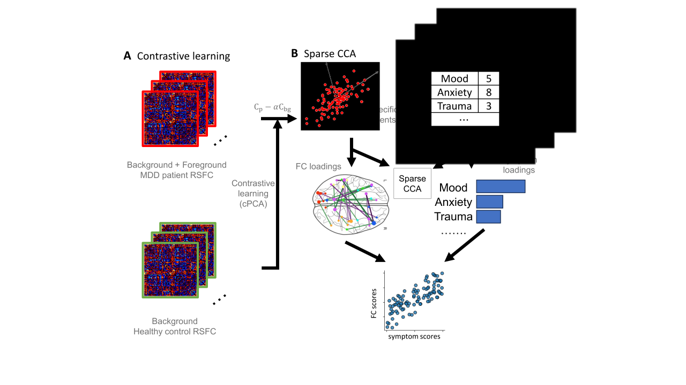

## Identify clinical-aware functional connectivity dimensions through contrastive PCA and sparse CCA

Zhu, H., Tong, X., Carlisle, N. B., Xie, H., Keller, C. J., Oathes, D. J., ... & Zhang, Y. (2024). [Contrastive functional connectivity defines neurophysiology-informed symptom dimensions in major depression](https://pmc.ncbi.nlm.nih.gov/articles/PMC11482755/). bioRxiv.

### Dataset used in study
#### MDD patients
- [EMBARC dataset](https://nda.nih.gov/edit_collection.html?id=2199)
#### Healthy controls
- [EMBARC dataset](https://nda.nih.gov/edit_collection.html?id=2199)
- [UCLA-CNP dataset](https://openneuro.org/datasets/ds000030/versions/1.0.0)
- [AOMIC dataset](https://openneuro.org/datasets/ds002785/versions/2.0.0)
- [LEMON dataset](https://openneuro.org/datasets/ds000221/versions/1.0.0)

### Usage
- Step 1: prepare healthy control connectivity data, patient connectivity data, and patient clinical assessment data (Example format of clinical assessment data is provided).
- Step 2: Train the model through cpca+scca2-exp.py. Example: `python cpca+scca2-exp.py --alpha 2.5 --penaltyu 0.8 --penaltyv 0.8`